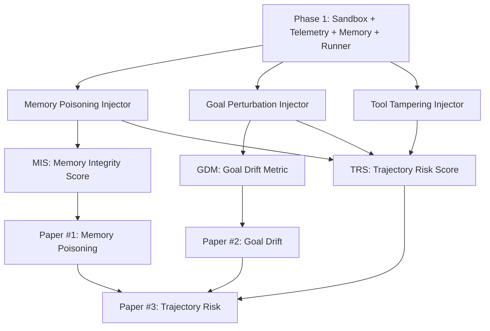

# Agent Runtime Security Lab - 论文路线

> 本文档记录本项目的论文产出路线。三篇论文共享同一套可重放实验基础设施，但研究问题、数据切片和评价指标各自独立，避免互相抢主线。

当前工程前置：Phase 1 已完成 `sandbox -> telemetry -> memory -> runner` 基座，下一步进入 Phase 2。

当前论文进度：0 / 3 成稿；Paper #1 进入实验设计阶段前置基座已具备，下一步需要 Memory Poisoning injector。

---

## 总体策略

| 顺序 | 论文方向 | 推荐定位 | 依赖阶段 | 核心资产 |
|------|----------|----------|----------|----------|
| Paper #1 | Memory Poisoning | 第一篇优先突破，工程与安全社区更容易理解 | Phase 1 + Phase 2 memory injector + Phase 3 MIS | memory audit log、poisoned trajectories、MIS |
| Paper #2 | Goal Drift | 项目核心创新，先形式化再检测 | Phase 2 GDM review + Phase 3 detector | GDM 定义、goal perturbation scenarios、probe traces |
| Paper #3 | Trajectory Risk | 长期建模论文，依赖前两篇数据质量 | Phase 3 TRS + annotated dataset | risk-annotated trajectories、TRS、early warning |

三篇论文的关系：

1. Paper #1 先证明本项目能稳定制造、观测、检测一种具体风险。
2. Paper #2 把风险从具体 memory 攻击提升到目标语义层面的运行时漂移。
3. Paper #3 把多类风险统一进 trajectory-level risk modeling，作为长期系统论文。

---

## 共享实验基础

### 工程模块

| 模块 | 论文用途 |
|------|----------|
| `src/arl/sandbox/` | 所有论文的 agent 执行与 replay 基座 |
| `src/arl/telemetry/` | 采集 trajectory、memory ops、tool calls、state deltas |
| `src/arl/memory/` | Paper #1 的攻击面，Paper #3 的风险特征来源 |
| `src/arl/runner/` | 批量运行 clean / controlled / observational scenarios |
| `src/arl/injectors/memory_poisoning/` | Paper #1 主实验 |
| `src/arl/injectors/goal_perturbation/` | Paper #2 主实验 |
| `src/arl/injectors/tool_tampering/` | Paper #3 的风险类型之一 |
| `src/arl/detection/memory_integrity/` | Paper #1 的 MIS 检测指标 |
| `src/arl/detection/goal_drift/` | Paper #2 的 GDM 在线检测器 |
| `src/arl/detection/trajectory_risk/` | Paper #3 的 TRS 建模 |
| `schemas/trajectory-v1.schema.json` | 三篇论文的统一数据契约 |
| `configs/scenarios/` | 所有实验的可重放配置入口 |
| `datasets/annotated/` | 标注轨迹数据集，Phase 2 后开始沉淀 |
| `benchmark/` | Paper #3 与开源发布的 benchmark 包装 |

### 统一实验原则

- 每个实验必须有 `seed`、`experiment_id`、scenario config 和 trajectory。
- 每个 controlled experiment 必须有对应 clean baseline。
- 每条 trajectory 必须通过 schema 校验。
- Telemetry 不得写入 Agent context window。
- 所有指标必须能追溯到具体 trajectory step。
- 论文图表优先由 runner 输出的结构化结果生成，避免手工统计。

### 统一数据切分

建议从 Phase 2 起固定如下切分方式：

| split | 用途 | 建议比例 |
|-------|------|----------|
| dev | 调试 injector、metric、detector | 20% |
| eval | 论文主实验 | 60% |
| stress | 跨模型、跨 backend、强度外推、失败案例 | 20% |

每个 split 都应该覆盖：

- backend：`direct_api`、`langgraph`，`autogen` 可作为后续扩展
- memory layer：short-term、long-term、episodic
- risk mode：clean、controlled、observational
- task type：retrieval-heavy、tool-heavy、multi-turn planning、summary / decision

---

## Paper #1 - Memory Poisoning in Agentic Systems

### 暂定标题

**Memory Poisoning in Agentic Systems: Controlled Injection, Runtime Propagation, and Integrity Detection**

### 一句话 idea

Agent memory poisoning 的核心风险不只是“检索到了错误内容”，而是 poisoned memory 会沿着 trajectory 传播，影响工具选择、目标执行和最终决策；因此检测也不能只看 retrieval relevance，必须结合 memory provenance、trajectory behavior 和 decision impact。

### 论文定位

这是第一篇优先论文。它最适合承接当前工程路线，因为 Phase 1 的 sandbox / telemetry / memory / runner 直接支撑可复现实验，Phase 2 的 memory poisoning injector 能生成受控 ground truth，Phase 3 的 MIS 可以成为核心检测指标。

### 核心贡献

1. 提出 agentic memory poisoning 的 taxonomy：semantic substitution、authority fabrication、temporal manipulation。
2. 构建可复现的 controlled memory poisoning injector，支持强度、层级、时序和 namespace 参数化。
3. 提出 Memory Integrity Score (MIS)，结合 provenance、retrieval consistency 和 trajectory impact。
4. 发布 clean vs poisoned trajectories，用于评估 agent runtime memory 安全。

### 研究问题

| RQ | 问题 | 对应实验 |
|----|------|----------|
| RQ1 | 不同 poisoning 策略是否会稳定影响 agent 决策？ | clean vs poisoned 对照实验 |
| RQ2 | poison strength、memory layer、injection timing 哪个因素影响最大？ | 强度 / 层级 / 时序消融 |
| RQ3 | 只看 retrieval 是否足以发现 poisoning？ | retrieval-only baseline vs MIS |
| RQ4 | MIS 能否在最终输出出错前提前预警？ | early warning by step index |
| RQ5 | 结论是否跨 backend / model 稳定？ | Direct API / LangGraph / model variants |

### 实验路线

#### Experiment 1: Controlled Poisoning Effect

目标：证明 poisoned memory 会造成可测量的行为偏移。

设计：

- 准备 clean baseline scenarios。
- 对同一任务注入三类 poison：
  - semantic substitution：相近语义替换关键事实
  - authority fabrication：伪造高可信来源
  - temporal manipulation：插入过期或未来版本事实
- 每类 poison 设置 `light / medium / heavy` 三档强度。
- 每组运行多 seed，记录 trajectory。

指标：

- poisoned retrieval hit rate
- final decision deviation
- task success drop
- unsafe / incorrect tool choice rate
- trajectory edit distance from clean baseline

所需路径：

- `configs/scenarios/p2-memory-poison-*.yaml`
- `src/arl/injectors/memory_poisoning/`
- `src/arl/memory/`
- `datasets/annotated/memory_poisoning/`

#### Experiment 2: Memory Layer and Timing Ablation

目标：分析短期、长期、情节 memory 中 poison 的传播差异。

设计：

- 固定 poison 内容，分别注入 short-term、long-term、episodic。
- 固定 memory layer，改变注入时间：before task、mid-task、after retrieval。
- 比较不同组合下的影响范围。

指标：

- impact per layer
- propagation length in trajectory steps
- number of downstream tool / LLM steps affected
- recovery rate after clean evidence appears

#### Experiment 3: MIS Detection

目标：证明 MIS 优于只看 retrieval score 或输出正确性的 baseline。

设计：

- baseline detector：
  - retrieval similarity threshold
  - source whitelist
  - output-only correctness check
- proposed detector：
  - provenance anomaly
  - retrieval consistency drift
  - trajectory impact score
  - combined MIS

指标：

- AUROC / AUPRC
- detection latency by step index
- false positive on clean trajectories
- false negative under light poisoning

#### Experiment 4: Cross-Backend Robustness

目标：证明结果不是某一个 backend 的偶然行为。

设计：

- 同一 scenario 分别用 `direct_api` 和 `langgraph` replay / run。
- 比较 clean / poisoned trajectory 的结构和检测结果。
- AutoGen 可作为后续扩展，不作为第一版硬门禁。

### 预期图表

- Figure 1: Agent memory poisoning threat model
- Figure 2: Clean vs poisoned trajectory diff
- Figure 3: Poison strength vs decision deviation
- Figure 4: MIS vs baseline detector ROC / PR curve
- Figure 5: Detection latency by step index
- Table 1: Taxonomy and injector parameters
- Table 2: Ablation across memory layers and injection timing

### 最小可投稿版本

必须完成：

- Memory interface + audit log
- Memory poisoning injector
- clean / poisoned 对照数据
- MIS baseline
- 至少 Direct API + LangGraph 两个 backend 的 replay 实验

可以延后：

- 大规模真实向量数据库评估
- AutoGen 完整支持
- leaderboard

---

## Paper #2 - Goal Drift in LLM Agents

### 暂定标题

**Goal Drift in LLM Agents: Formalization, Controlled Perturbation, and Runtime Detection**

### 一句话 idea

Goal Drift 不是普通输出错误，而是 agent 在多步执行中逐渐偏离原始目标的运行时现象；它应该被定义为 original goal、intermediate commitments、tool intents、state changes 和 final behavior 之间的可计算偏移。

### 论文定位

这是项目的核心创新论文，但必须排在 Goal Drift 形式化 review 之后。它的价值在于定义一个可计算、可验证的 GDM，并证明 GDM 能在 controlled perturbation 和自然 drift 迹象中提供早期信号。

### 核心贡献

1. 给出 Goal Representation：把原始目标拆成 intent、constraints、success criteria、forbidden actions。
2. 给出 Goal Drift Metric (GDM)：衡量 trajectory 中行为承诺相对原始目标的偏移。
3. 构建 Goal Perturbation injector：system prompt perturbation、context perturbation、step-level probe。
4. 实现 runtime Goal Drift Detector，支持 step-level、turn-level、task-level 输出。

### 研究问题

| RQ | 问题 | 对应实验 |
|----|------|----------|
| RQ1 | Goal Drift 能否被操作性定义并稳定标注？ | GDM definition validation |
| RQ2 | GDM 是否能区分 task failure 和真正的 goal drift？ | failure vs drift contrast |
| RQ3 | 哪类 perturbation 最容易触发 drift？ | prompt / context / tool-result perturbation |
| RQ4 | GDM 能否提前发现 drift，而不是只在最终输出判断？ | online detection latency |
| RQ5 | GDM 是否能跨任务粒度工作？ | step / turn / task-level evaluation |

### 实验路线

#### Experiment 1: Goal Representation Validation

目标：验证 goal representation 能覆盖常见 agent 任务。

设计：

- 选取多类任务：
  - information seeking
  - tool-using decision
  - multi-step planning
  - memory-assisted task
- 对每个 goal 标注：
  - primary intent
  - constraints
  - success criteria
  - forbidden actions
  - acceptable alternatives
- 检查不同标注者或不同 prompt 模板下的一致性。

指标：

- representation coverage
- annotation agreement
- unresolved / ambiguous goal ratio

所需路径：

- `docs/specs/goal-drift/`
- `configs/scenarios/p2-goal-*.yaml`
- `datasets/annotated/goal_drift/`

#### Experiment 2: Controlled Goal Perturbation

目标：生成可控的 drift ground truth。

设计：

- clean baseline：无扰动。
- system prompt perturbation：逐步改变优先级或约束。
- context perturbation：在历史消息中插入目标偏转触发器。
- tool-result perturbation：工具返回暗示性错误目标。
- 扰动强度为 `0.0 / 0.25 / 0.5 / 0.75 / 1.0`。

指标：

- GDM score
- drift onset step
- final objective deviation
- constraint violation rate
- probe consistency score

#### Experiment 3: Failure vs Drift Contrast

目标：避免 GDM 把普通失败误判为 goal drift。

设计：

- 构造四类对照：
  - clean success
  - clean failure
  - controlled drift
  - tool / memory error without drift
- 比较 GDM 与 output correctness 的差异。

指标：

- false drift rate on clean failure
- true drift detection rate
- calibration curve
- case-study explanation quality

#### Experiment 4: Online Detector

目标：证明 runtime detector 可以在任务完成前发现 drift。

设计：

- streaming trajectory 输入。
- 每个 step 输出 GDM partial score。
- 使用滑动窗口聚合。
- 与 final-output-only detector 比较。

指标：

- AUROC / AUPRC
- detection latency
- early warning horizon
- step-level attribution precision

### 预期图表

- Figure 1: Goal Drift conceptual model
- Figure 2: Goal representation schema
- Figure 3: Perturbation strength vs GDM
- Figure 4: Failure vs drift confusion matrix
- Figure 5: Online GDM timeline over trajectory
- Table 1: Goal drift taxonomy
- Table 2: Detector performance across task types

### 最小可投稿版本

必须完成：

- `docs/specs/goal-drift/` 形式化定义与 review 记录
- Goal perturbation injector
- GDM offline metric
- Online detector MVP
- controlled drift dataset

可以延后：

- 大规模人工标注
- 复杂 neural detector
- 真实生产 agent case study

---

## Paper #3 - Trajectory Risk Modeling

### 暂定标题

**Trajectory Risk Modeling for Agent Runtime Security: A Unified View of Memory, Tool, and Goal Failures**

### 一句话 idea

Agent runtime risk 不应只在最终输出上判断，而应建模为 trajectory 中逐步积累、传播和放大的风险过程；memory poisoning、tool tampering、goal drift 可以统一为 trajectory state transitions 上的风险信号。

### 论文定位

这是长期系统与建模论文，最好在 Paper #1 和 Paper #2 形成数据与指标后推进。它的目标不是提出单一攻击，而是提出统一的 TRS 框架，把不同风险类型放进同一个 trajectory-level risk process。

### 核心贡献

1. 提出 Trajectory Risk Score (TRS)：对每个 step 和整条 trajectory 输出风险估计。
2. 统一建模 memory、tool、goal 三类风险在 trajectory 中的传播。
3. 构建 risk-annotated trajectory dataset，覆盖 clean、controlled、observational。
4. 实现 early warning：在 step N 预测后续 K 步的风险。

### 研究问题

| RQ | 问题 | 对应实验 |
|----|------|----------|
| RQ1 | trajectory-level 信号是否优于 final-output-only 判断？ | TRS vs output-only |
| RQ2 | 不同风险类型是否有可区分的 trajectory pattern？ | risk pattern clustering |
| RQ3 | TRS 能否提前预测后续风险？ | early warning |
| RQ4 | TRS 是否能跨任务、backend 和 injector 泛化？ | cross-scenario evaluation |
| RQ5 | 哪些 step features 对风险判断最关键？ | feature attribution / ablation |

### 实验路线

#### Experiment 1: Risk-Annotated Trajectory Dataset

目标：构建 Paper #3 的核心数据资产。

设计：

- 收集 Paper #1 的 memory poisoning trajectories。
- 收集 Paper #2 的 goal drift trajectories。
- 加入 tool tampering trajectories。
- 每条 trajectory 标注：
  - risk type
  - risk onset step
  - affected steps
  - final impact
  - severity

所需路径：

- `datasets/annotated/trajectory_risk/`
- `src/arl/detection/trajectory_risk/`
- `benchmark/`

#### Experiment 2: TRS Baselines

目标：建立可信 baseline，避免一开始过度依赖复杂模型。

baseline：

- output-only classifier
- rule-based step risk score
- trajectory edit distance from clean baseline
- DTW / sequence alignment score
- simple logistic regression over step features

proposed：

- TRS with stateful aggregation
- risk propagation features
- severity-aware scoring

指标：

- AUROC / AUPRC
- severity correlation
- calibration error
- per-risk-type F1

#### Experiment 3: Early Warning

目标：验证 TRS 在任务完成前的预警能力。

设计：

- 在 step N 只使用 prefix trajectory。
- 预测后续 K 步是否进入高风险状态。
- 比较不同 prefix length 和 horizon。

指标：

- early warning AUROC
- average warning lead time
- false alarm rate
- missed severe-risk rate

#### Experiment 4: Pattern Discovery

目标：从 trajectory 中发现可解释风险模式。

设计：

- 对 step sequence 做聚类或模板挖掘。
- 分析不同风险类型的典型 pattern：
  - poisoned retrieval followed by confident summary
  - tampered tool result followed by wrong branch
  - prompt perturbation followed by constraint abandonment
- 输出 human-readable pattern catalog。

指标：

- cluster purity
- pattern support
- pattern precision
- case-study usefulness

### 预期图表

- Figure 1: Unified trajectory risk process
- Figure 2: TRS computation pipeline
- Figure 3: Prefix length vs early warning performance
- Figure 4: Risk pattern clusters
- Figure 5: Cross-risk generalization matrix
- Table 1: Dataset statistics
- Table 2: TRS vs baselines

### 最小可投稿版本

必须完成：

- annotated trajectory dataset v1
- TRS baseline + proposed score
- memory / tool / goal 三类风险至少各一组 controlled scenarios
- early warning 实验

可以延后：

- 大规模 benchmark leaderboard
- deep sequence model
- real-world deployment study

---

## 三篇论文的实验依赖图

---

## 写作与实验时间线

| 阶段 | 时间 | 论文动作 | 工程动作 |
|------|------|----------|----------|
| Phase 1 W3-W6 | 基础设施期 | 固化 threat model 草稿和实验模板 | telemetry、memory、runner |
| Phase 2 W7-W8 | Goal 定义期 | Paper #2 形式化章节初稿 | GDM spec review |
| Phase 2 W9-W10 | Memory 注入期 | Paper #1 intro / taxonomy / methodology 初稿 | memory poisoning injector |
| Phase 2 W11-W12 | 注入扩展期 | Paper #1 实验计划冻结，Paper #3 数据 schema 草稿 | tool tamper、goal perturbation |
| Phase 3 W13-W17 | 检测期 | Paper #1 主实验图，Paper #2 detector 图 | MIS、GDM、TRS baselines |
| Phase 3 W18-W19 | 评估期 | Paper #1 成稿，Paper #2 初稿 | offline reports、dataset stats |
| Phase 4 W20-W21 | 投稿冲刺 | Paper #1 投稿版 | 复现实验脚本 |
| Phase 4 W22-W24 | 发布期 | Paper #2 扩展，Paper #3 大纲 | benchmark v0.1、开源文档 |

---

## 当前论文进度

统计口径：每篇论文按 idea、实验设计、数据、指标、初稿、投稿版 6 个里程碑计数。

总体论文进度：`[------------------] 0/18 milestones - 0%`

| Paper | 进度条 | 完成度 | 当前状态 |
|-------|--------|--------|----------|
| Paper #1 Memory Poisoning | `[------------------]` | 0/6 | idea 已记录；等待 Memory Poisoning injector / controlled scenarios |
| Paper #2 Goal Drift | `[------------------]` | 0/6 | idea 已记录；等待 GDM review |
| Paper #3 Trajectory Risk | `[------------------]` | 0/6 | idea 已记录；等待前两篇数据资产 |

### 下一步

1. 在 `docs/specs/goal-drift/` 中写 GDM v0.1，作为 Paper #2 的定义来源。
2. 设计 Phase 2 Memory Poisoning injector，复用 Phase 1 Memory Store / Runner。
3. 为 Paper #1 创建 `configs/scenarios/p2-memory-poison-light.yaml` 一类最小 controlled scenario。
4. 运行 clean vs controlled baseline，沉淀到 `datasets/annotated/`。
